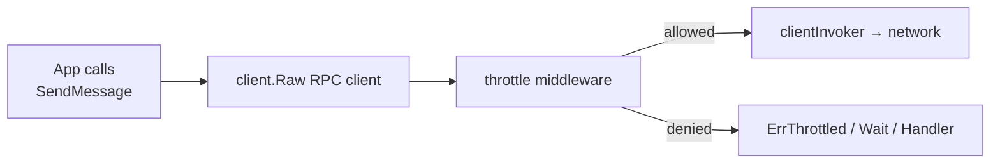

# mtgo plugin: throttle

Local anti-spam / rate-limiting plugin for [mtgo](https://github.com/mtgo-labs/mtgo) Telegram bots and userbots. Prevents a client from sending too many RPC requests too quickly by enforcing configurable rules **before** the request reaches Telegram — no external dependencies beyond mtgo.

## Features

- **Multiple scopes** — global, per-method, per-chat, per-user, or custom key function
- **Rule-based configuration** — stack independent rules; a request must pass all matching rules
- **Burst support** — allow short spikes beyond the steady-state limit
- **Three exceed behaviors** — fail-fast (`ErrThrottled`), wait-until-allowed, or custom handler
- **Typed `ErrThrottled`** — carries the rule name, retry-after duration, and scope key
- **Concurrency-safe** — per-key locking; throttling chat A never blocks chat B
- **Zero dependencies** — uses only the Go standard library + mtgo

## Install

```bash
go get github.com/mtgo-labs/plugins/throttle
```

## Quick start

```go
import (
    tg "github.com/mtgo-labs/mtgo/telegram"
    "github.com/mtgo-labs/plugins/throttle"
)

func main() {
    client, _ := tg.NewClient(apiID, apiHash, &tg.Config{
        BotToken:    botToken,
        SessionName: "my_bot",
    })

    client.Use(throttle.New(throttle.Config{
        Rules: []throttle.Rule{
            {
                Name:     "send-message-per-chat",
                Match:    throttle.MatchMethod("messages.sendMessage"),
                Scope:    throttle.ScopeChat,
                Limit:    20,
                Window:   time.Minute,
                Exceeded: throttle.FailFast,
            },
            {
                Name:     "global-rpc",
                Scope:    throttle.ScopeGlobal,
                Limit:    100,
                Window:   time.Minute,
                Burst:    20,
                Exceeded: throttle.Wait,
            },
        },
    }))

    client.Start() // plugin middleware is installed during Connect
}
```

## How it works

The plugin implements `tg.Plugin`. On `Start` it installs an invoker-level middleware via `client.UseInvokerMiddleware`. Every typed RPC call (`SendMessage`, `SendMedia`, `EditMessage`, …) flows through `client.Raw()`, which applies the middleware chain. The throttle middleware inspects each outgoing `tg.TLObject`, matches it against the configured rules, and either permits, denies, or delays the call — all before any network I/O.



## Scopes

| Scope | Key | Description |
|-------|-----|-------------|
| `ScopeGlobal` | `"global"` | Single shared budget across all calls |
| `ScopeMethod` | `"method:<name>"` | One budget per RPC method (e.g. `messages.sendMessage`) |
| `ScopeChat` | `"chat:<id>"` | One budget per target conversation (DM, group, or channel) |
| `ScopeUser` | `"user:<id>"` | One budget per target user (DM peers only) |
| `ScopeCustom` | caller-defined | Use the `Key` field to supply a custom `KeyFunc` |

Chat and user scope keys are derived by reflecting on the request's `Peer` field (`tg.InputPeerClass`). This works automatically for all request types that have a `Peer` field — `messages.sendMessage`, `messages.sendMedia`, `messages.sendMultiMedia`, `messages.editMessage`, `messages.sendReaction`, `messages.setTyping`, and hundreds more. The reflection is cached per constructor ID, so the per-call cost is one map lookup + one field read.

## Exceed behaviors

```go
Exceeded: throttle.FailFast  // return *ErrThrottled immediately (default)
Exceeded: throttle.Wait       // block until budget frees, then retry
Exceeded: throttle.Custom     // call Rule.Handler with *ErrThrottled
```

**FailFast** — the call returns an `*ErrThrottled` without reaching Telegram:

```go
msg, err := client.SendMessage(ctx, chatID, "hi")
var throttled *throttle.ErrThrottled
if errors.As(err, &throttled) {
    log.Printf("rate-limited by rule %q, retry in %s",
        throttled.Rule, throttled.RetryAfter)
    time.Sleep(throttled.RetryAfter)
    // retry…
}
```

**Wait** — the call blocks inside the middleware until the rule permits it, honouring `ctx.Done()`. Useful for background workers that should self-pace rather than drop work:

```go
// This call will sleep ~RetryAfter, then succeed automatically.
msg, err := client.SendMessage(ctx, chatID, "queued message")
```

**Custom** — the `Rule.Handler` receives the `*ErrThrottled` and decides the outcome:

```go
{
    Exceeded: throttle.Custom,
    Handler: func(ctx context.Context, te *throttle.ErrThrottled) error {
        metrics.Throttled.Inc()
        return te // propagate as-is, or return nil to allow through
    },
}
```

## Rule reference

```go
type Rule struct {
    Name     string        // human-readable, appears in ErrThrottled.Rule
    Match    Matcher       // nil = match all requests
    Scope    Scope         // key dimension (ignored when Key is set)
    Key      KeyFunc       // custom key function (overrides Scope)
    Limit    int           // max requests per window (≥ 1)
    Window   time.Duration // rolling window (default 1s when ≤ 0)
    Burst    int           // extra requests allowed (ceiling = Limit + Burst)
    Exceeded Behavior      // FailFast | Wait | Custom
    Handler  func(ctx context.Context, err *ErrThrottled) error
}
```

### Matchers

| Constructor | Matches |
|-------------|---------|
| `MatchMethod("messages.sendMessage")` | Exact method name(s) |
| `MatchMethod("a", "b", "c")` | Any of the listed methods |
| `MatchPrefix("messages.send")` | Any method starting with prefix |
| `MatchAll()` | Every request |
| `MatchAny(m1, m2, …)` | Union of matchers |

### ErrThrottled

```go
type ErrThrottled struct {
    Rule       string        // rule name
    RetryAfter time.Duration // soonest safe retry
    Scope      string        // throttle key (e.g. "chat:123")
}
```

Use `errors.As` to extract it from wrapped errors.

## Standalone usage (without a plugin lifecycle)

```go
th := throttle.New(throttle.Config{
    Rules: []throttle.Rule{{
        Name: "demo", Scope: throttle.ScopeGlobal,
        Limit: 5, Window: time.Minute,
    }},
})

// Check without a client or network:
if err := th.Allow(ctx, req); err != nil {
    log.Println("throttled:", err)
}

// Or register the middleware manually:
client.UseInvokerMiddleware(th.Middleware())
```

## Throttle vs FloodWait

This is the most important distinction to understand:

| | **This plugin (local throttle)** | **Telegram FloodWait** |
|---|---|---|
| **Where** | Client-side, before the request leaves your process | Server-side, after Telegram rejects the call |
| **When** | Preventive — the request never reaches Telegram | Reactive — the request was sent and rejected |
| **Cause** | Your local rules say "too fast" | Telegram's anti-abuse system says "too fast" |
| **Error type** | `*throttle.ErrThrottled` | `*tgerr.Error` (code 420) via `tgerr.AsFloodWait` |
| **Configurable** | Fully — you set the limits, windows, scopes, behaviors | No — Telegram decides the wait duration |
| **Network cost** | Zero (no round-trip) | One wasted round-trip per rejection |

**Use both together.** The throttle plugin is your first line of defence — it prevents most FLOOD_WAIT errors by staying under known limits. But Telegram's limits are dynamic and undocumented, so some calls may still trigger a server-side FloodWait. Handle that separately with `tgerr.AsFloodWait`:

```go
msg, err := client.SendMessage(ctx, chatID, "hello")

// 1. Local throttle (this plugin)
var local *throttle.ErrThrottled
if errors.As(err, &local) {
    log.Printf("locally throttled: %s", local.RetryAfter)
    return
}

// 2. Server-side FloodWait (Telegram's enforcement)
if wait, ok := tgerr.AsFloodWait(err); ok {
    log.Printf("server flood-wait: %s", wait)
    time.Sleep(wait)
    // retry…
}
```

## Design notes

- **Sliding-window log.** Each key maintains a slice of request timestamps within the window. On each call, expired entries are compacted out; if capacity remains the timestamp is appended. `RetryAfter` is computed from the oldest surviving entry. Exact, not approximate.
- **Per-key isolation.** Each key has its own `sync.Mutex` inside its `bucket`. A global `sync.Map` maps keys → buckets. Throttling one key never contends with another.
- **Background sweeper.** A goroutine (started on `Start`, stopped on `Stop`) periodically purges buckets with no recent activity, preventing unbounded memory growth for userbots that interact with many peers.
- **Reflection caching.** Peer extraction uses `reflect` to find the `Peer` field, but the field index is cached per constructor ID after the first lookup — subsequent calls are a map hit + one field read.
- **Sequential rule evaluation.** Rules are checked in order. A request must pass all matching rules. When rules overlap, each consumes a token from its own independent budget before the next rule is checked; a denial aborts immediately.

## License

MIT
